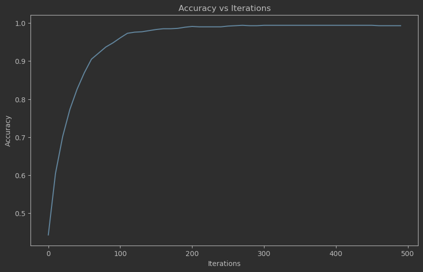
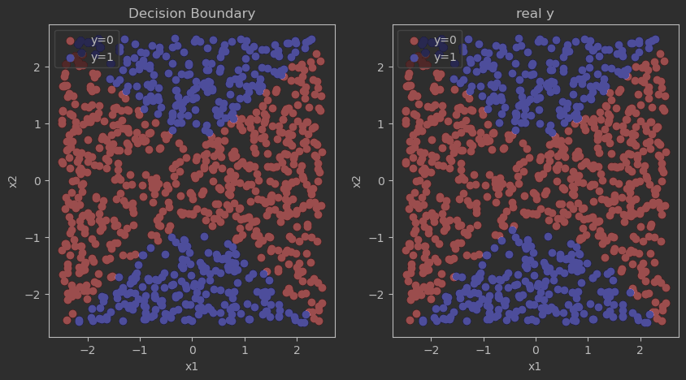

# A Brief Guide to Classification

> **给 LHM Summer Program AI课程小伙伴的速救指南**
> Author: [*Lifan Lin*](https://flammingfrost.github.io/tech-blog/)
> Date: *2023-08-15*
> 为了避免语言上的障碍,还是用中文写吧

---

## 1. 什么是分类问题

分类问题(classification)是区别与回归问题(regression)的一类问题. 最直接的区别是模型的输出:
- Regression: 一个连续的数值. 比如预测房价, 预测股价等等. 数值的范围往往是实数域.
- Classification: 一个离散的数值. 比如预测一个图片是猫还是狗, 预测一个人的性别等等. 数值的范围往往是有限的(类别).

由于输出的数值类型有所区别, 所采取的方法也有所不同. 

> 注意: 逻辑斯蒂回归(Logistic Regression)是一种分类算法, 而不是回归算法.

## 2. 损失函数: 交叉熵(Cross Entropy)

### 2.1 独热编码(One-hot Encoding)

以日常的习惯, 我们也许会使用不同的数字来表达不同的分类 (*比如使用1表示西瓜, 2表示苹果, 3表示香蕉 等等*), 但这对于我们的模型是不合理的. 因为这样的数字之间存在着大小关系, 而实际上这些数字只是用来区分不同的类别而已. ~~即使是有序的离散变量(如排名), 也不应该直接使用数字来表示.(因为包含了等差距的假设)~~

假设我们有一个分类向量, 可以这样转换:
原始向量x:
```python
x = [1, 2, 0, 1, 1, 2, 0, 0] #共有三类
x = np.array(x)
```
将他转换位独热编码:
```python
num_classes = 3
x_one_hot = np.zeros((x.shape[0], num_classes))
for i in range(num_classes):
    x_one_hot[x == i, i] = 1

print(x_one_hot)
```
输出:
```python
x_one_hot = 

[[1. 0. 0.]
 [0. 1. 0.]
 [0. 0. 1.]
 [1. 0. 0.]
 [1. 0. 0.]
 [0. 1. 0.]
 [0. 0. 1.]
 [0. 0. 1.]]
```

## 2.2 交叉熵(Cross Entropy)

交叉熵是一种损失函数, 用来衡量两个概率分布之间的差异. 交叉熵越**小**, 两个概率分布越**接近**. 我们希望模型的预测分类和真实分类尽可能的接近, 因此我们希望交叉熵越小越好.
交叉熵的公式如下:
$$
H(p, q) = -\sum_{x}^{\text{n\_class}}p(x)log(q(x))
$$
注意: 这里的$p(x)$是真实的概率分布, $q(x)$是模型的预测概率分布.
用$y$表示真实的分类, 用$\hat{y}$表示模型的预测分类, 交叉熵可以写成:
$$
H(y, \hat{y}) = -\sum_{x}^{\text{n\_class}}y(x)log(\hat{y}(x))
$$
如果分类只有两类, 那么交叉熵可以简化为:
$$
H(y, \hat{y}) = -ylog(\hat{y}) - (1-y)log(1-\hat{y})
$$
其中$y$是真实的分类, $\hat{y}$是模型的预测分类.

## 2.3 Sigmod函数
> 这玩意我真不知道有中文名叫什么, 所以就用英文名了.

### 为什么需要Sigmod函数

当我使用线性模型来预测分类, 我们需要预测各个分类的概率. 然而线性模型的输出是实数域的, 因此我们需要一个函数将实数域的值映射到(0, 1)之间.

在逻辑斯蒂回归中,我们使用了sigmoid函数, 因为他具有很好的性质. 具体如下:
1. 他的值域在(0, 1)之间, 因此可以用来表示概率.
sigmoid函数的公式如下:
$$
\sigma(x) = \frac{1}{1+e^{-x}}
$$
他将实数域的值映射到(0, 1)之间.

2. 他是单调递增的, 因此他的值越大, 概率越大.
3. 他是可微的, 而且求导非常简单.
对二分类变量$x\in\{0, 1\}$, sigmoid函数的导数如下:
$$
\sigma'(x) = \sigma(x)(1-\sigma(x))
$$
对于多分类变量$x\in\{0, 1, ..., n\}$, 用独热编码(one-hot)表示时, sigmoid函数如下:
$$
\sigma(x) = \frac{e^{x_i}}{\sum_{i=0}^{n}e^{x_i}}
$$
其导数如下:
$$
\sigma'(x) = \sigma(x)(1-\sigma(x))\\
= \frac{e^{x_i}}{\sum_{i=0}^{n}e^{x_i}}(1-\frac{e^{x_i}}{\sum_{i=0}^{n}e^{x_i}})\\
$$
> 也许有人觉得二分类和多分类的sigmoid函数不一样, 但其实是一样的. 模型上是等价的. 形式会有一点区别.

## 2.4 交叉熵的导数

**请一定熟悉矩阵乘法, 矩阵求导等等. 并清晰自己每一步操作得到的矩阵大小是多少. 不然就等着🐖🧠过载吧**

### 链式法则

> 我觉得各位不至于连链式法则都不知道, 但还是提一下吧.

对于一个复合函数$L = CE(\sigma(z(x)))$, 其中$CE$是交叉熵, $\sigma$是sigmoid函数, $z$是线性模型, $x$是输入. 我们可以使用链式法则求导:
$$
\frac{\partial L}{\partial x} = \frac{\partial L}{\partial \sigma}\frac{\partial \sigma}{\partial z}\frac{\partial z}{\partial x}
$$
对于逻辑斯蒂模型, 我们只需要分别计算$\frac{\partial L}{\partial \sigma}$, $\frac{\partial \sigma}{\partial z}$, $\frac{\partial z}{\partial x}$即可.

### 交叉熵的导数

#### $$\frac{\partial L}{\partial \sigma}$$

二分类:
$$
\begin{aligned}
\frac{\partial L}{\partial \sigma} &= \frac{\partial}{\partial \sigma}(-ylog(\sigma) - (1-y)log(1-\sigma))\\
&= -\frac{y}{\sigma} + \frac{1-y}{1-\sigma}
\end{aligned}
$$
多分类:
$$
\begin{aligned}
\frac{\partial L}{\partial \sigma} &= \frac{\partial}{\partial \sigma}(-\sum_{i=0}^{C}y_ilog(\sigma_i))\\
\frac{\partial L}{\partial \sigma_i} &= -\frac{y_i}{\sigma_i}
\end{aligned}
$$
这里$\sigma$是一个向量, $\sigma_i$是向量的第$i$个元素.

#### $$\frac{\partial \sigma}{\partial z}$$

二分类:
$$
\begin{aligned}
\frac{\partial \sigma}{\partial z} &= \frac{\partial}{\partial z}\frac{1}{1+e^{-z}}\\
&= \frac{e^{-z}}{(1+e^{-z})^2}\\
&= \frac{1}{1+e^{-z}}\frac{e^{-z}}{1+e^{-z}}\\
&= \sigma(1-\sigma)
\end{aligned}
$$

多分类:(不仔细写了, 只是麻烦点, 可以看这里: https://zhuanlan.zhihu.com/p/86787709)
$$
\begin{aligned}
\frac{\partial \sigma}{\partial z} &= \frac{\partial}{\partial z}\frac{e^{z_i}}{\sum_{i=0}^{n}e^{z_i}}\\
&= \frac{e^{z_i}\sum_{i=0}^{n}e^{z_i} - e^{z_i}e^{z_i}}{(\sum_{i=0}^{n}e^{z_i})^2}\\
&= \frac{e^{z_i}}{\sum_{i=0}^{n}e^{z_i}}(1-\frac{e^{z_i}}{\sum_{i=0}^{n}e^{z_i}})\\
&= \sigma(1-\sigma)
\end{aligned}
$$

#### $$\frac{\partial z}{\partial x}$$

这里的$z$是线性模型的输出, 也就是$z = Wx + b$, 其中$W$是权重矩阵, $b$是偏置向量. 因此:
$$
\frac{\partial z}{\partial x} = W
$$

### 梯度下降

希望你们没有忘记梯度是什么. 梯度的方向是函数上升的方向.

对于大部分问题, 优化损失函数没有显式解(close form solution), 因此我们需要使用梯度下降来优化损失函数. 梯度下降的公式如下:

$$
\theta_{t+1} = \theta_t - \alpha \nabla L(\theta_t)
$$
其中$\theta$是模型的参数, $L$是损失函数, $\alpha$是学习率, 有时候也写作$\eta$. 注意负号, 因为我们希望梯度下降, 而不是梯度上升. $\nabla L(\theta_t)$是损失函数在$\theta_t$处的梯度.

我们有很多种方法估计$\nabla L(\theta_t)$, 从使用的数据量的不同, 分为三类:
- Batch Gradient Descent: 使用全部数据来估计梯度.
- Stochastic Gradient Descent: 使用一个样本来估计梯度.
- Mini-batch Gradient Descent: 使用一个batch的样本来估计梯度.

基本围绕着估计准确性和高效性的权衡.

在代码中我会使用Batch Gradient Descent, 但是在实际应用中, 我们往往使用Mini-batch Gradient Descent. 只要是怕太复杂了您们不好理解. :-)

### 编程实现

> 肯定有人看懂了不会打代码的, 所以我就写了一下代码. 

但是我不保证代码是对的, ~~因为我没跑过~~跑过了.这里只用二分类做例子, 多分类的自己写.
先造一点数据:

```python
import numpy as np
import matplotlib.pyplot as plt

# 造一点数据
X = (np.random.rand(1000, 2)-0.5)*5 # (n, p)
y = (-X[:, 0]**2 + X[:, 1]**2 > 0.5) * 1 # (n, 1)

# 构造一些特征：x1^2, x2^2, x1, x2, 1
X = np.concatenate([X, np.ones((X.shape[0], 1)), X**2], axis=1) # (n, 6)

# 绘制一下数据
plt.figure(figsize=(10, 10), dpi=100)
plt.title("Data")
plt.xlabel("x1")
plt.ylabel("x2")
plt.scatter(X[y==0, 0], X[y==0, 1], c='r', label="y=0")
plt.scatter(X[y==1, 0], X[y==1, 1], c='b', label="y=1")
plt.legend()
```

```python
# 定义各个函数
def sigmoid(x):
    # x: (n, p)
    # return: (n, p)
    return 1 / (1 + np.exp(-x))

def cross_entropy(y, y_hat):
    # y: (n, 1)
    # y_hat: (n, 1)
    # return: 标量
    return np.sum(-y * np.log(y_hat) - (1 - y) * np.log(1 - y_hat))

def cal_z(x, W):
    # x: (n, p)
    # W: (p, 1) 二分类问题, 对于多分类问题, W的维度是(p, C)
    return np.dot(x, W) # (n, 1)

def cal_loss(x, y, W):
    y_hat = sigmoid(cal_z(x, W))
    return cross_entropy(y, y_hat)

def cal_grad(x, y, W):
    # x: (n, p)
    # y: (n, 1)
    # W: (p, 1)
    # return: (p, 1)

    z = cal_z(x, W)
    y_hat = sigmoid(z)
    y = y.reshape(-1, 1) # (n, 1)

    dL_dsigma = -y / y_hat + (1 - y) / (1 - y_hat) # (n, 1)
    dsigma_dz = y_hat * (1 - y_hat) # (n, 1)
    dz_dw = x # (n, p)

    grad = (dL_dsigma * dsigma_dz).T.dot(dz_dw) # (1, n) * (n, p) = (1, p)
    grad = grad.T # (p, 1)
    grad /= x.shape[0] # (p, 1)

    return grad

def accuracy(x, y, W):
    # 我们用一个简单的方法来计算准确率
    y_hat = sigmoid(cal_z(x, W))
    y_hat = y_hat.reshape(-1)
    y_hat = y_hat > 0.5
    y_hat = y_hat * 1
    # 这里0.5是一个阈值, 可以自己调整
    return np.mean(y_hat == y)

```

```python

# 参数初始化
## 二分类问题
train_size = 1000
num_features = 5
num_classes = 1

## model parameters initialization
W = np.random.randn(num_features, num_classes) # (p, 1)


# 运用梯度下降优化损失函数

iterations = 500
learning_rate = 1e-1 # 学习率, 可以自己调整. 对于不同问题, 学习率的选择是不同的.

# 绘图参数
plt.figure(figsize=(10, 6), dpi=100)
plt.title("Accuracy vs Iterations")
plt.xlabel("Iterations")
plt.ylabel("Accuracy")

accs = []
## 50次迭代绘制一次图
iters_obs = range(0, iterations, 10)


for i in range(iterations):
    grad = cal_grad(X, y, W)
    W -= learning_rate * grad
    loss = cal_loss(X, y, W)
    if i in iters_obs:
        acc = accuracy(X, y, W)
        accs.append(acc)
        # print("Iteration: {}, Loss: {}, Accuracy: {}".format(i, loss, acc))

# 绘图
plt.plot(iters_obs, accs)
plt.show()

# 绘制决策边界
plt.subplots(figsize=(10, 5), dpi=100)
plt.subplot(1, 2, 1)
plt.title("Decision Boundary of Model")
plt.xlabel("x1")
plt.ylabel("x2")
y_hat = sigmoid(cal_z(X, W))
label_pred = y_hat > 0.5
label_pred = label_pred.reshape(-1)
plt.scatter(X[label_pred==0, 0], X[label_pred==0, 1], c='r', label="y=0")
plt.scatter(X[label_pred==1, 0], X[label_pred==1, 1], c='b', label="y=1")
plt.legend()

plt.subplot(1, 2, 2)
plt.title("Ground Truth")
plt.xlabel("x1")
plt.ylabel("x2")
plt.scatter(X[y==0, 0], X[y==0, 1], c='r', label="y=0")
plt.scatter(X[y==1, 0], X[y==1, 1], c='b', label="y=1")
plt.legend()
plt.show()
```
#### 



